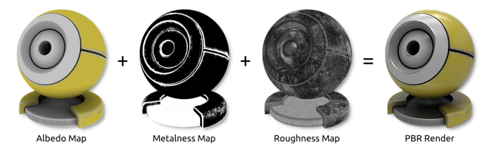
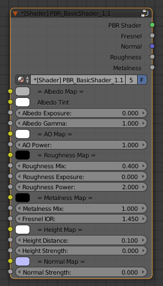
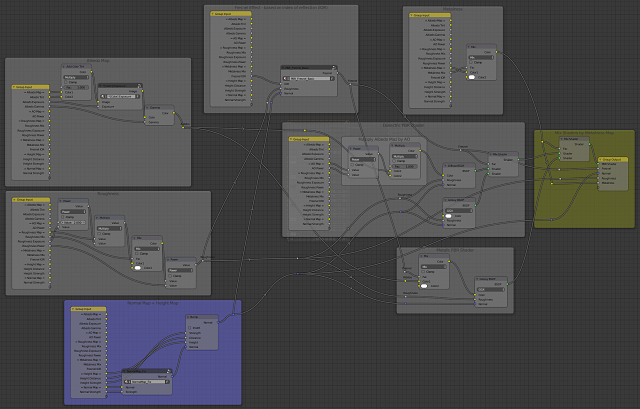
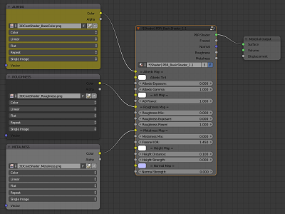
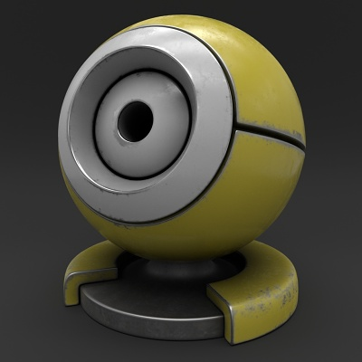
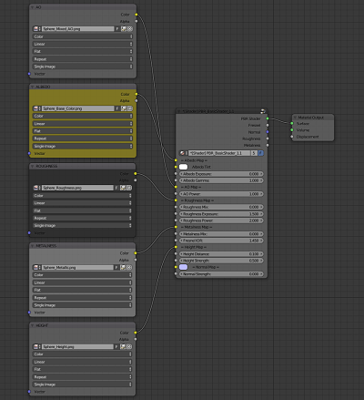

.. title: PBR Shader Node for Blender
.. slug: nodes-pbr-basic-shader
.. date: 2017-02-23 15:00:00 UTC+02:00
.. category: blender
.. tags: mathjax, blender-materials
.. link: 
.. description:
.. type: text

**PBR (Physically Based Rendering)** seems to be the standard for photorealistic rendering in these days. All major rendering and texturing packages like 3D-Coat, Substance Painter or Marmoset already have this lighting model implemented. Blender is going to include a real-time PBR viewport in version 2.8. However, no need to wait for the new release, thanks to the **Cycles Render**, we can already create a dedicated node setup for the **PBR shader**. We can also use this shader for rendering material maps baked in other programs that already works on the PBR basis.

    

    PBR (Physically Based Rendering) material maps.

.. TEASER_END

1 Building a PBR Shader Node
==================================

    Node group for the PBR shader.

There have been already published many node setups implementing a PBR shader, but I wanted to make a more versatile setup that would enable to modify things like texture color tint, exposure, etc within a single node. Moreover, I have included the fix to remove some artifact caused by rendering normal maps (viz `this post <https://blenderartists.org/forum/showthread.php?382497-Black-material-artifacts-on-flat-angle-surface-areas&p=3156851&viewfull=1#post3156851>`_).

To build a PBR shader we need to take into account these material features:

.. class:: li-medskip

    - **Albedo Map** - defines the material color under diffuse light. Compared to the diffuse map, albedo doesn't contain any directional light or ambient occlusion which should be provided by a separate map. However, if not aspiring for perfect physical accuracy, we can use diffuse map as well.

    - **Ambient Occlusion Map** - represents occluded light based on the 3D geometry of the material surface.

    - **Metalness Map** - specifies **dielectric** (black 0.0) or **metallic** (white 1.0) reflection type.

    - **Roughness Map** - specifies **smooth** (black 0.0) or **rough** (white 1.0) microsurface.

    - **Height Map** - material surface displacements described by a greyscale image.

    - **Normal Map** - material surface displacements described by a RGB image.

    - **Fresnel Effect (IOR value)** - is quite complicated physical effect, hard to implement accurately in Blender. Basically, the material reflection increases with angle of incidence, so the object rim at grazing angles is more reflexive than the rest of the object. Blender's Fresnel node approximates that behavior by **IOR** (index of reflection) value, but we should also consider that this effect decreases with growing roughness.

.. raw:: html

    <video class="video center" autoplay loop>
        <source src="demo_pbr_metallic_360p.mp4">
        Your browser does not support the video tag.
    </video>
    

        Animated demo for a metallic PBR material (metalness=1.0, roughness varies from 0.0 to 1.0 and back).
    

    <video class="video center" autoplay loop>
        <source src="demo_pbr_dielectric_360p.mp4">
        Your browser does not support the video tag.
    </video>
    

        Animated demo for a dielectric PBR material (metalness=0.0, roughness varies from 0.0 to 1.0 and back).
    

    Node setup for the PBR shader.

2 Rendering PBR Maps from 3D-Coat
=====================================

    PBR maps from 3D-Coat rendered in Blender.
    

    PBR maps from 3D-Coat rendered in Blender.

3 Rendering PBR Maps from Substance Painter
============================================

    PBR maps from Substance Painter rendered in Blender.

.. container:: figures-container center

    .. figure:: cycles-render-sp-bronze.tn.jpg
        :target: cycles-render-sp-bronze.jpg
        :figclass: thumbnail

    .. figure:: cycles-render-sp-painted.tn.jpg
        :target: cycles-render-sp-painted.jpg
        :figclass: thumbnail

    .. figure:: cycles-render-sp-silver.tn.jpg
        :target: cycles-render-sp-silver.jpg
        :figclass: thumbnail

Download
========

- Download a `blend file <https://www.dropbox.com/s/455pxqcqicucboq/PBR_BasicShader.blend?dl=0>`_ with the PBR shader node (made in Blender 2.78).

