.. title: Correct HDRI Environment Map Exposure in Blender
.. slug: nodes-correct-hdri
.. date: 2017-06-05 15:00:00 UTC+02:00
.. category: blender
.. tags: mathjax, blender-rendering
.. link: 
.. description:
.. type: text

Lighting your scene with a HDRI environment map is a great method how to improve quality of your renders. Not only that it provides realistic reflections for glossy materials, but also creates colored lights and shadows in the most realistic way since every pixel of the environment map actually stands for a light source illuminating the scene.

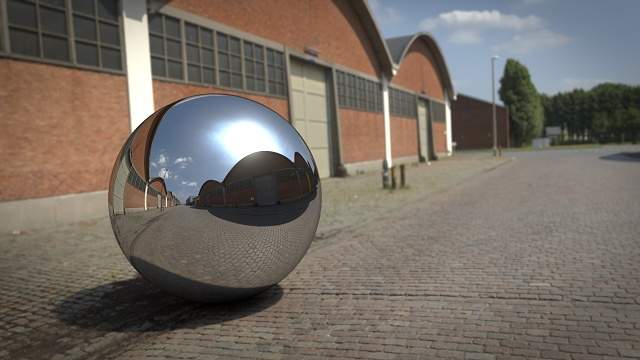

    A simple mesh sphere and plane illuminated by a HDRI environment map.

.. TEASER_END

1 A Very Brief Introduction to HDRI
========================================

**HDRI (high dynamic range images)** are image files with extended bit depth (usually 32bit per color channel). Thanks to that, they are capable to capture extremely high range of luminance. That's simply essential for capturing real lighting conditions in outdoor environments, where the difference between the luminance of sun and the rest of the scene might be up to 20 EV (exposure value numbers) or even more.

There are two most common file formats: **Radiance HDR (.hdr)** and **OpenEXR (.exr)**. OpenEXR is often preferred in Blender, because it enables to store renders with multiple layers and passes for post-processing and also seems to be more memory effective, but HDR files should work fine as well.

Of course, capturing a 360deg panoramic environment map with such a high range of exposure is not an easy task. I think, there is no camera capable to capture such dynamic range in a single shot. Exposure bracketing and using filters is essential. All that difficulties are the reason why quality HDRI images are quite rare and expansive. However, there are many sites providing HDRIs for free, usually in reduced resolution.

2 Basic Node Setup for HDRI Lighting
======================================

If you have a physically accurate HDRI environment map, using it for illuminating your scene in Blender is extremely easy (we use Cycles Render and Node Editor here). Just make a **World Material** with **Environment Texture** and **Background Shader**. If you want to rotate the environment, just add a **Mapping** node and you can rotate it around Z axis.

.. figure:: basic-hdri-lighting.tn.png
    :target: basic-hdri-lighting.png
    :align: center
    :class: figure-radius

    Lighting the scene with a HDRI environment map.

If you want to use the HDRI only for lighting and reflections, but have a different background, you can do it directly with nodes. Just use the **Is Camera Ray** attribute and plug it into a **Mix Shader**. The example below uses a spherical gradient as a background to create sort of vignette effect.

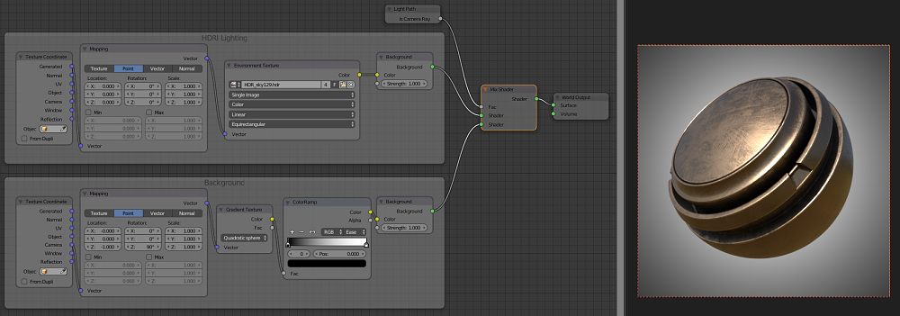

    Lighting the scene with a HDRI, but using different background.

2.1 Render with a Shadow Catcher Plane
-------------------------------------------

A neat effect can be achieved when we use an additional mesh plane to catch shadows of the mesh objects. In this case we just need to create a new material for the plane according the node setup below (don't forget to set the same Z axis rotation in the world shader and plane material).

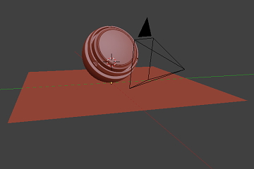

    Add an additional mesh plane to catch shadows.

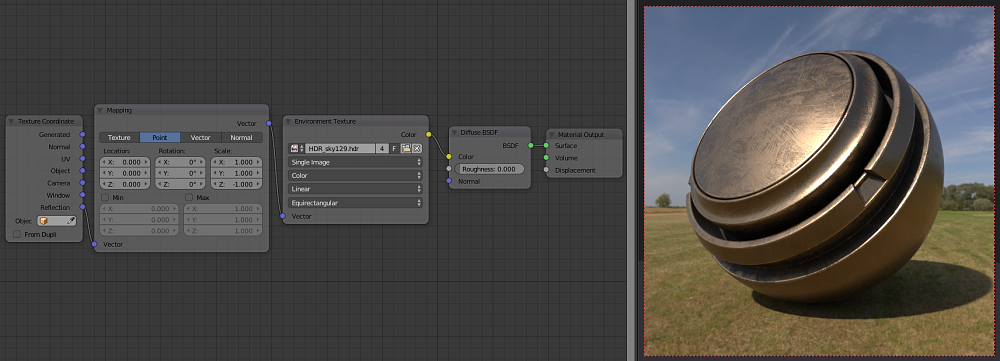

    Node setup for the shadow catcher plane material.

3 Inaccurate HDRI Environment Maps
========================================

If a HDRI map is physically inaccurate, there might be some problems being emerged:

.. class:: li-smallskip

    - **Missing strong shadows where expected** - the HDRI has insufficient dynamic range, the sun luminance need to be significantly higher than the rest of the sky to create crisp and strong shadows.

    - **When using a shadow catcher plane, the plane is too dark or too light compared to the HDRI on the background** - inaccurate exposure levels make the mesh scene illuminated inaccurately and sometimes color temperature might be wrong as well.

Practically, almost all HDRI maps are more or less physically inaccurate (especially the free ones), because creating 100% accurate HDRI map is indeed a very difficult task. At least, I didn't find any free HDRI that wouldn't need any adjusting.

.. container:: figures-container center

    .. figure:: hdri-problem-01.tn.jpg
        :target: hdri-problem-01.jpg
        :figclass: thumbnail

        Too low exposure range, sun luminance is not strong enough to illuminate the scene properly and to create strong shadows.

    .. figure:: hdri-problem-02.tn.jpg
        :target: hdri-problem-02.jpg
        :figclass: thumbnail

        HDRI illuminates the shadow catcher plane too much.

4 Node Setups to Correct HDRI Lighting
========================================

Using nodes within the shadow catcher material and the world shader, we can fix all problems of HDRI lighting without the need to modify the actual HDRI file.

4.1 Match the Shadow Catcher Material
----------------------------------------

The easiest thing we might try to do is to modify the shadow catcher material to match the background. I used my custom **Exposure node** here and also a setup to match color temperature.

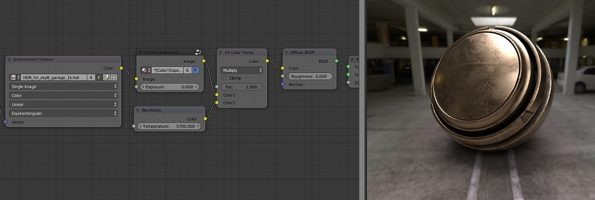

    Here we fixed the problem nicely by lowering exposure and matching color temperature for the shadow catcher material.

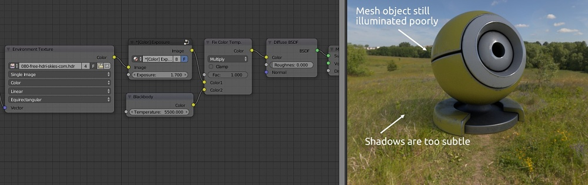

    We managed to match the shadow catcher plane by increasing exposure and color temperature. Yet the result is not what I would expect at direct sunlight, the mesh object is too dark and shadows are too subtle.

4.2 A Versatile Node Setup for the World Shader
--------------------------------------------------

So, even when we match the shadow catcher plane, the result might look disappointing. We need to be able to increase the exposure range, especially for the sun. To do so, I've developed a versatile node setup that enables not only to increase the sun exposure, but also tune the strength separately for all these parts: **background**, **lighting**, **reflections**.

To fine tune the strength of all rendering components separately, we can use the light path attributes **Is Camera Ray** and **Is Glossy Ray** with the mix shaders as in this node setup:

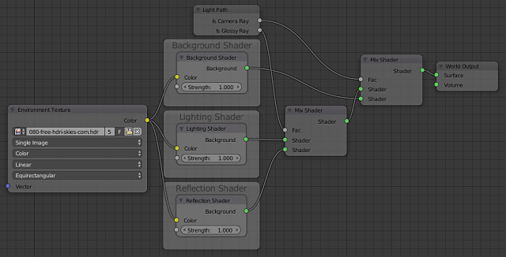

    Node setup to split rendering shaders and set their strength.

To increase the sun luminance and the dynamic exposure range accordingly, we can create a mask detecting the sun area and multiply the luminance strength there. With nodes it can look like this:

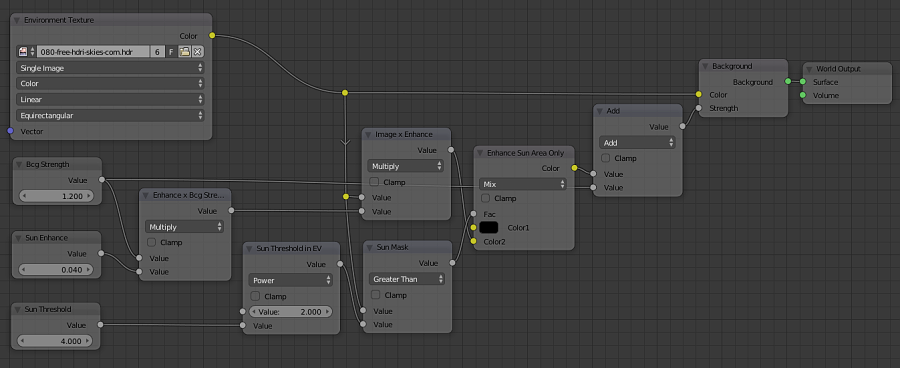

    Node setup to enhance the sun exposure.

Now, lets put everything together into a complete node group to correct any HDRI world shader. The node can also correct the color temperature of the illuminating light, therefore the color fix is applied only for the lighting and reflection shaders, but not for the background shader.

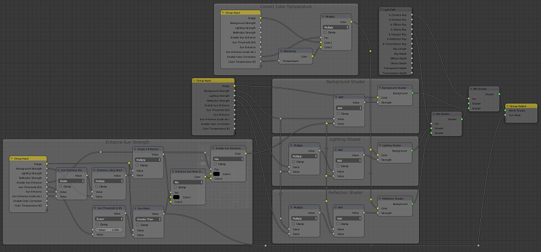

    The complete node setup for correcting the HDRI World Shader.

In the example below, we managed to fix our problematic HDRI with insufficient exposure range. Now it looks as expected for a direct sunlight scene! Note that we didn't need to modify the actual HDRI file and we fixed it by world shader nodes.

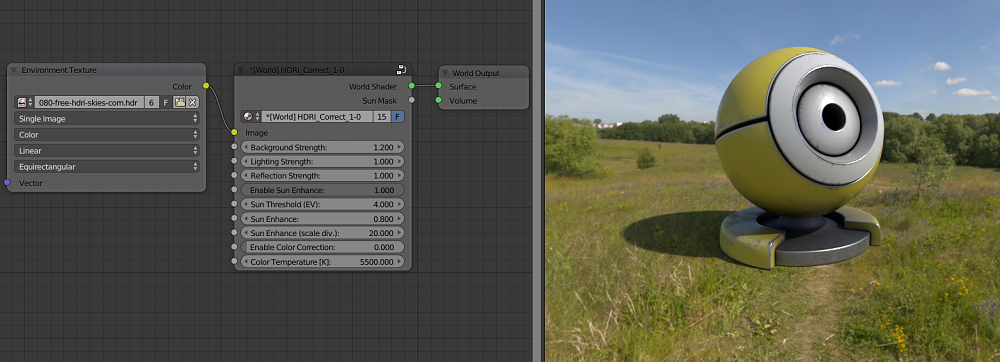

    We increased the sun exposure and now it perfectly illuminates our scene and creates crisp shadows.

4.3 Modify the HDRI File using Blender Compositor
----------------------------------------------------

Another option is to fix the actual HDRI file. Of course, you could use a photo editor (like Photoshop) which supports HDRI files. But no need to use any expansive program, we can modify HDRI files directly in Blender!

In the Node Editor, switch to the **Compositing** and the result of your modifications you can see in the UV/Image Editor as the **Viewer Node**. Then, you can save the Viewer Node image as a new HDRI file. *Hint: you can select the default export file type in Properties - Output*.

To make things easier, I've created a correction node group also for the Compositor. It enables to increase the sun exposure the same way as the HDRI_Correct node for the World Shader. The only thing Compositor misses, is the color temperature in Kelvins, so we need to provide color correction in RGB format.

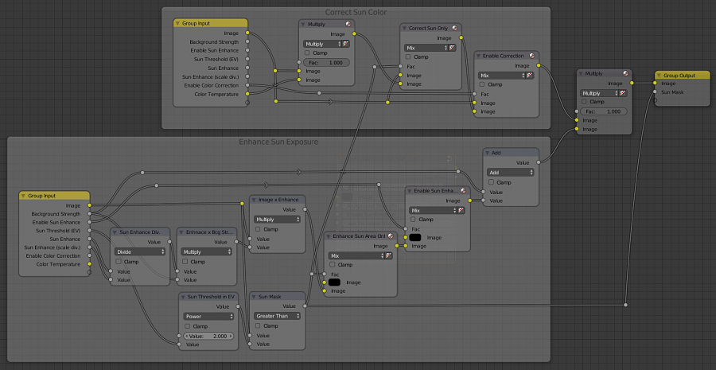

    The compositor node setup for HDRI_Correct.

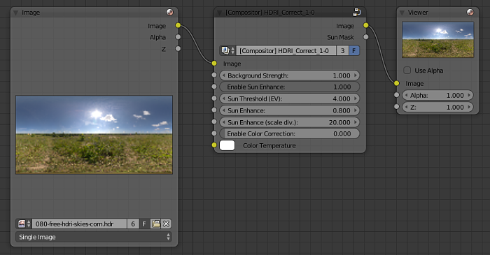

    Correcting the HDRI file in the Compositor using our custom node.

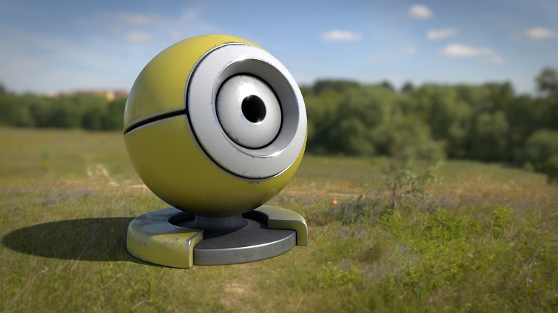

    My final render made using the sun exposure corrected HDRI file. Note the blur and vignette effect added later in compositor.

5 Conclusion
=============

We have proven that Blender is all capable of using HDRI maps for illuminating mesh scenes. If we need to use a physically incorrect HDRI file, we can workaround its exposure directly within the world shader. Moreover, we can use the Blender Compositor as a photo editor to correct the actual HDRI file and increase its exposure range and correct color temperature of the sun.

References
============

- Download a `blend file <https://www.dropbox.com/s/21k1awgks1ai976/HDRI_CorrectExposure.blend?dl=0>`_ (made in Blender 2.78) including free HDRI images (CC-BY licensed) from hdrihaven.com and hdri-skies.com.

- https://hdrihaven.com/ - HDRI of various sceneries incl. free versions in 1024x512px.

- http://hdri-skies.com/ - HDRI of skies and landscapes incl. free version in 2048x1024px.

- http://hdrmaps.com/ - HDRI of various sceneries incl. freebies.

