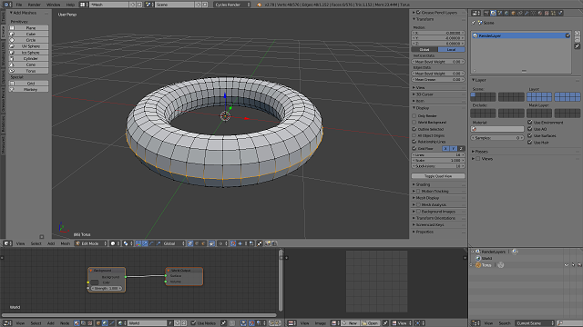
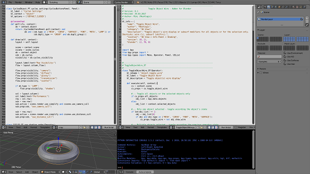

.. title: Elegant Grey Flat Theme for Blender
.. slug: elegant-grey-theme
.. date: 2017-02-09 12:00:00 UTC+02:00
.. category: blender
.. tags: blender-themes
.. link: 
.. description:
.. type: text

.. TEASER_END

My custom theme I have been tuning since I started to learn Blender.

Modifications to the default Blender theme:
    - Flat buttons with thin grey borders.
    - All toggle and radio buttons are blue highlighted when selected.
    - Light grey background for script editor, which I find better readable than the dark background.

Download
========
- Download `here <miki_1-1.xml>`_
- Download from `BlendSwap <https://www.blendswap.com/blends/view/88003>`_

